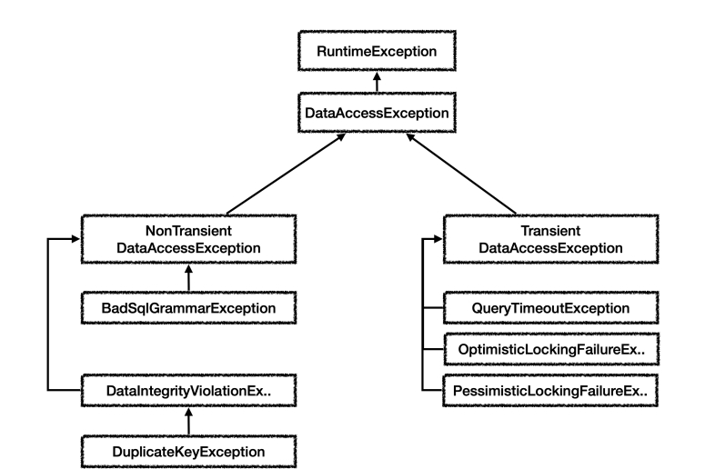

# spring-jdbc
테스트에서도 @Slfj4와 같은 애노테이션을 사용하기
build.gradle
```
dependencies {
 //테스트에서 lombok 사용
 testCompileOnly 'org.projectlombok:lombok'
 testAnnotationProcessor 'org.projectlombok:lombok'
}
```

대표적인 커넥션 풀 오픈소스는 commons-dbcp2 , tomcat-jdbc pool , HikariCP 등이 있다.

설정과 사용의 분리
```
설정: DataSource 를 만들고 필요한 속성들을 사용해서 URL , USERNAME , PASSWORD 같은 부분을 입력하는
것을 말한다. 이렇게 설정과 관련된 속성들은 한 곳에 있는 것이 향후 변경에 더 유연하게 대처할 수 있다.
사용: 설정은 신경쓰지 않고, DataSource 의 getConnection() 만 호출해서 사용하면 된다
```

스프링 부트 3.1 이상 - 로그 출력 안되는 문제 해결

src/main/resources/logback.xml
```xml
<configuration>
 <appender name="STDOUT" class="ch.qos.logback.core.ConsoleAppender">
 <encoder>
 <pattern>%d{HH:mm:ss.SSS} [%thread] %-5level %logger{36} -%kvp- 
%msg%n</pattern>
 </encoder>
 </appender>
 <root level="DEBUG">
 <appender-ref ref="STDOUT" />
 </root>
</configuration>
```
스프링 부트 3.1 부터 기본 로그 레벨을 INFO 로 빠르게 설정하기 때문에 로그를 확인할 수 없는데, 이렇게하면 기본
로그 레벨을 DEBUG 로 설정해서 강의 내용과 같이 로그를 확인할 수 있다.

트랜잭션 ACID
트랜잭션은 ACID(http://en.wikipedia.org/wiki/ACID)라 하는 원자성(Atomicity), 일관성(Consistency), 격리
성(Isolation), 지속성(Durability)을 보장해야 한다.
```
원자성: 트랜잭션 내에서 실행한 작업들은 마치 하나의 작업인 것처럼 모두 성공 하거나 모두 실패해야 한다.
일관성: 모든 트랜잭션은 일관성 있는 데이터베이스 상태를 유지해야 한다. 예를 들어 데이터베이스에서 정한 무
결성 제약 조건을 항상 만족해야 한다.
격리성: 동시에 실행되는 트랜잭션들이 서로에게 영향을 미치지 않도록 격리한다. 예를 들어 동시에 같은 데이터
를 수정하지 못하도록 해야 한다. 격리성은 동시성과 관련된 성능 이슈로 인해 트랜잭션 격리 수준(Isolation
level)을 선택할 수 있다.
지속성: 트랜잭션을 성공적으로 끝내면 그 결과가 항상 기록되어야 한다. 중간에 시스템에 문제가 발생해도 데이
터베이스 로그 등을 사용해서 성공한 트랜잭션 내용을 복구해야 한다.
```

트랜잭션은 원자성, 일관성, 지속성을 보장한다. 문제는 격리성인데 트랜잭션 간에 격리성을 완벽히 보장하려면 트랜잭
션을 거의 순서대로 실행해야 한다. 이렇게 하면 동시 처리 성능이 매우 나빠진다. 이런 문제로 인해 ANSI 표준은 트랜
잭션의 격리 수준을 4단계로 나누어 정의했다.
```
트랜잭션 격리 수준 - Isolation level
READ UNCOMMITED(커밋되지 않은 읽기)
READ COMMITTED(커밋된 읽기)
REPEATABLE READ(반복 가능한 읽기)
SERIALIZABLE(직렬화 가능) 
```

커밋 설정
```
set autocommit true; //자동 커밋 모드 설정(기본)
set autocommit false; //수동 커밋 모드 설정
```

원자성: 트랜잭션 내에서 실행한 작업들은 마치 하나의 작업인 것처럼 모두 성공 하거나 모두 실패해야 한다.
트랜잭션의 원자성 덕분에 여러 SQL 명령어를 마치 하나의 작업인 것 처럼 처리할 수 있었다. 성공하면 한번에 반영하
고, 중간에 실패해도 마치 하나의 작업을 되돌리는 것 처럼 간단히 되돌릴 수 있다.

조회와 락
데이터를 조회할 때도 락을 획득하고 싶을 때가 있다. 이럴 때는 select for update 구문을 사용하면 된다.
```sql
ex) select * from member where member_id='memberA' for update;
```

DataSourceUtils.getConnection()
```
getConnection() 에서 DataSourceUtils.getConnection() 를 사용하도록 변경된 부분을 특히 주의
해야 한다.
DataSourceUtils.getConnection() 는 다음과 같이 동작한다.
트랜잭션 동기화 매니저가 관리하는 커넥션이 있으면 해당 커넥션을 반환한다.
트랜잭션 동기화 매니저가 관리하는 커넥션이 없는 경우 새로운 커넥션을 생성해서 반환한다.
```

DataSourceUtils.releaseConnection()
```
close() 에서 DataSourceUtils.releaseConnection() 를 사용하도록 변경된 부분을 특히 주의해야
한다. 커넥션을 con.close() 를 사용해서 직접 닫아버리면 커넥션이 유지되지 않는 문제가 발생한다. 이 커넥
션은 이후 로직은 물론이고, 트랜잭션을 종료(커밋, 롤백)할 때 까지 살아있어야 한다.
DataSourceUtils.releaseConnection() 을 사용하면 커넥션을 바로 닫는 것이 아니다.
트랜잭션을 사용하기 위해 동기화된 커넥션은 커넥션을 닫지 않고 그대로 유지해준다.
트랜잭션 동기화 매니저가 관리하는 커넥션이 없는 경우 해당 커넥션을 닫는다.
```

스프링이 제공하는 트랜잭션 AOP
```
스프링이 제공하는 AOP 기능을 사용하면 프록시를 매우 편리하게 적용할 수 있다. 스프링 핵심 원리 - 고급편을
통해 AOP를 열심히 공부하신 분이라면 아마도 @Aspect , @Advice , @Pointcut 를 사용해서 트랜잭션 처
리용 AOP를 어떻게 만들지 머리속으로 그림이 그려질 것이다.
물론 스프링 AOP를 직접 사용해서 트랜잭션을 처리해도 되지만, 트랜잭션은 매우 중요한 기능이고, 전세계 누구
나 다 사용하는 기능이다. 스프링은 트랜잭션 AOP를 처리하기 위한 모든 기능을 제공한다. 스프링 부트를 사용하
면 트랜잭션 AOP를 처리하기 위해 필요한 스프링 빈들도 자동으로 등록해준다.
개발자는 트랜잭션 처리가 필요한 곳에 @Transactional 애노테이션만 붙여주면 된다. 스프링의 트랜잭션
AOP는 이 애노테이션을 인식해서 트랜잭션 프록시를 적용해준다
```

데이터소스와 트랜잭션 매니저 자동 등록
application.properties
```properties
spring.datasource.url=jdbc:h2:tcp://localhost/~/test
spring.datasource.username=sa
spring.datasource.password=
```

예외 계층 그림


Object : 예외도 객체이다. 모든 객체의 최상위 부모는 Object 이므로 예외의 최상위 부모도 Object 이다.
Throwable : 최상위 예외이다. 하위에 Exception 과 Error 가 있다.
Error : 메모리 부족이나 심각한 시스템 오류와 같이 애플리케이션에서 복구 불가능한 시스템 예외이다. 애플리
케이션 개발자는 이 예외를 잡으려고 해서는 안된다.
상위 예외를 catch 로 잡으면 그 하위 예외까지 함께 잡는다. 따라서 애플리케이션 로직에서는
Throwable 예외도 잡으면 안되는데, 앞서 이야기한 Error 예외도 함께 잡을 수 있기 때문이다. 애플리
케이션 로직은 이런 이유로 Exception 부터 필요한 예외로 생각하고 잡으면 된다.
참고로 Error 도 언체크 예외이다.
Exception : 체크 예외
애플리케이션 로직에서 사용할 수 있는 실질적인 최상위 예외이다.
Exception 과 그 하위 예외는 모두 컴파일러가 체크하는 체크 예외이다. 단 RuntimeException 은 예
외로 한다.
RuntimeException : 언체크 예외, 런타임 예외
컴파일러가 체크 하지 않는 언체크 예외이다.
RuntimeException 과 그 자식 예외는 모두 언체크 예외이다.
RuntimeException 의 이름을 따라서 RuntimeException 과 그 하위 언체크 예외를 런타임 예외라
고 많이 부른다. 여기서도 앞으로는 런타임 예외로 종종 부르겠다.


* 언체크 예외 기본 이해
  * RuntimeException 과 그 하위 예외는 언체크 예외로 분류된다.
  * 언체크 예외는 말 그대로 컴파일러가 예외를 체크하지 않는다는 뜻이다.
  * 언체크 예외는 체크 예외와 기본적으로 동일하다. 차이가 있다면 예외를 던지는 throws 를 선언하지 않고, 생략할 수 있다. 이 경우 자동으로 예외를 던진다.

* 체크 예외 VS 언체크 예외
  * 체크 예외: 예외를 잡아서 처리하지 않으면 항상 throws 에 던지는 예외를 선언해야 한다.
  * 언체크 예외: 예외를 잡아서 처리하지 않아도 throws 를 생략할 수 있다.

* 언체크 예외의 장단점 
  언체크 예외는 예외를 잡아서 처리할 수 없을 때, 예외를 밖으로 던지는 throws 예외 를 생략할 수 있다. 이것 때문에 장점과 단점이 동시에 존재한다.
  * 장점: 신경쓰고 싶지 않은 언체크 예외를 무시할 수 있다. 체크 예외의 경우 처리할 수 없는 예외를 밖으로 던지려
  면 항상 throws 예외 를 선언해야 하지만, 언체크 예외는 이 부분을 생략할 수 있다. 이후에 설명하겠지만, 신경
  쓰고 싶지 않은 예외의 의존관계를 참조하지 않아도 되는 장점이 있다.
  * 단점: 언체크 예외는 개발자가 실수로 예외를 누락할 수 있다. 반면에 체크 예외는 컴파일러를 통해 예외 누락을
  잡아준다.

스프링 데이터 접근 예외 계층


각 DB의 에러 정보를 가지고 있는 파일
sql-error-codes.xml